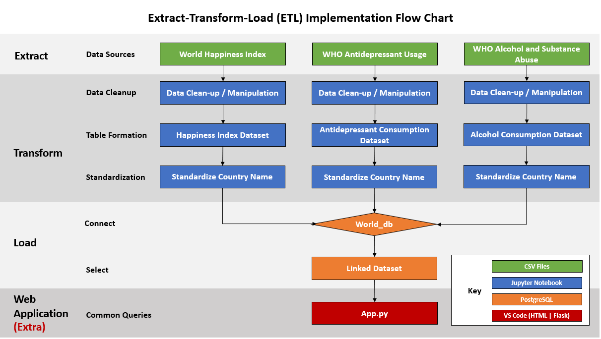
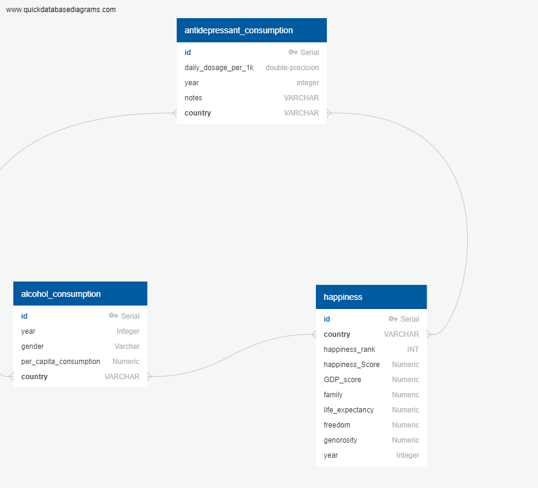
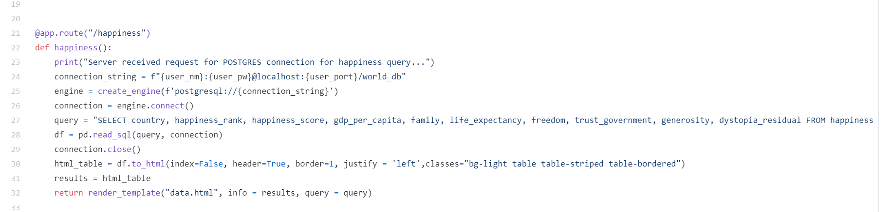

# Back Benchers 2 - ETL Project

## Project: Scrapping the data on World Happiness, the usage of alcohol, and antidepressant

### Members:
#### Ahmed, Mir
#### Anderson, Nina
#### Krenicki, Mathew
#### Zanoria, Dan

## ETL

## ORM Diagram

## Example of ETL App Code

## Key Files
#### Proposal Folder - Contains our project proposal
#### Resources - All source data files (CSVs)
#### Slides - Contains overview process flow slide on data flows, coding process
#### ETL_app.py - Our connected app to run queries online
#### ETL_happiness_alc_abuse... - Jupyter notebook file containing the extraction and transformation
#### QUERIES.sql - Example queries we ran using PgAdmin
#### SCHEMA.sql - Table schema for PgAdmin
#### MAP_PLOTS.ipynb - Visual global map plots of data points from data sets
